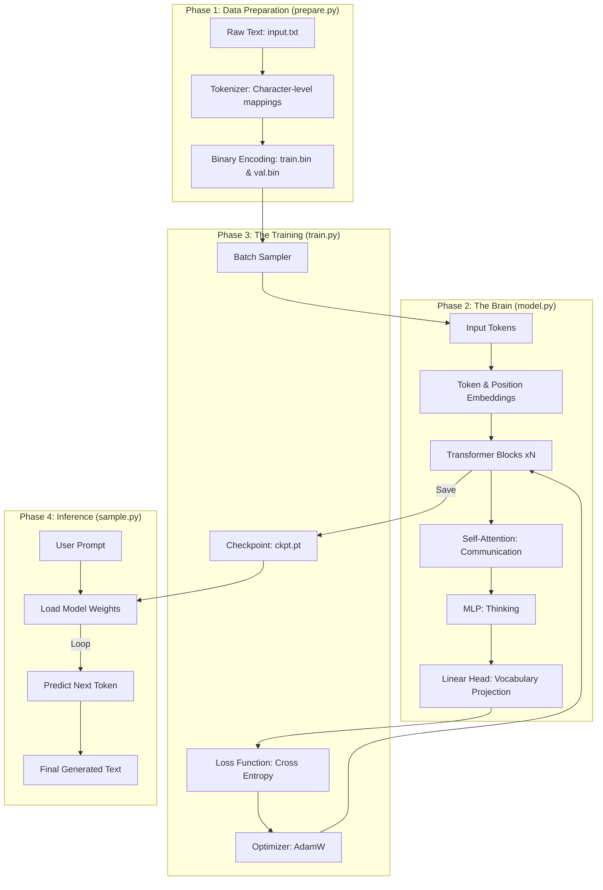

# Learning nanoGPT: A Deep Dive Guide

This document serves as a study plan and technical overview for understanding the nanoGPT codebase, optimized for learning how modern Large Language Models (LLMs) work from the ground up.

---

## 🟢 The nanoGPT Flowchart: From Text to "Shakespeare"

---

## 📚 Comprehensive Study Plan

Study the files in this order to build a mental model of the system sequentially.

### Phase 1: The Input Pipeline (`data/shakespeare_char/prepare.py`)
*   **Concepts to Master**: Tokenization (mapping characters/words to integers), Train/Val splits, and `numpy.memmap`.
*   **Key Question**: How does a computer "read" text?
*   **Logic**: See how it builds a vocabulary of 65 characters and converts the entire book into one long stream of integers stored in binary format for fast access.

### Phase 2: The Architecture (`model.py`)
*   **Concepts to Master**: Self-Attention, Multi-Head Attention, Residual Connections, and Layer Normalization.
*   **Key Question**: How does the model learn relationships between tokens?
*   **File Breakdown**:
    1.  `CausalSelfAttention`: The "communication" layer where tokens talk to each other.
    2.  `MLP`: The "thinking" layer where each token processes its information.
    3.  `Block`: The "container" that stacks Attention and MLP.
    4.  `GPT`: The top-level class that manages embeddings and the transformer stack.

### Phase 3: The Training Loop (`train.py`)
*   **Concepts to Master**: Backpropagation, Learning Rate Schedulers (Cosine Decay), Gradient Accumulation, and Checkpointing.
*   **Key Question**: How do we mathematically update weights to reduce error?
*   **File Breakdown**:
    1.  `get_batch`: How random chunks of data are sampled during training.
    2.  `estimate_loss`: How performance is monitored on validation data.
    3.  `The Optimization Loop`: Where gradients are calculated and AdamW updates the model parameter.

### Phase 4: Creative Generation (`sample.py`)
*   **Concepts to Master**: Autogression (feeding output back as input), Temperature, and Top-K sampling.
*   **Key Question**: How does "Predict the next word" turn into a full paragraph?
*   **Logic**: Uses the `generate` function in `model.py` to loop through predictions, picking the most likely next character and appending it to the sequence.
